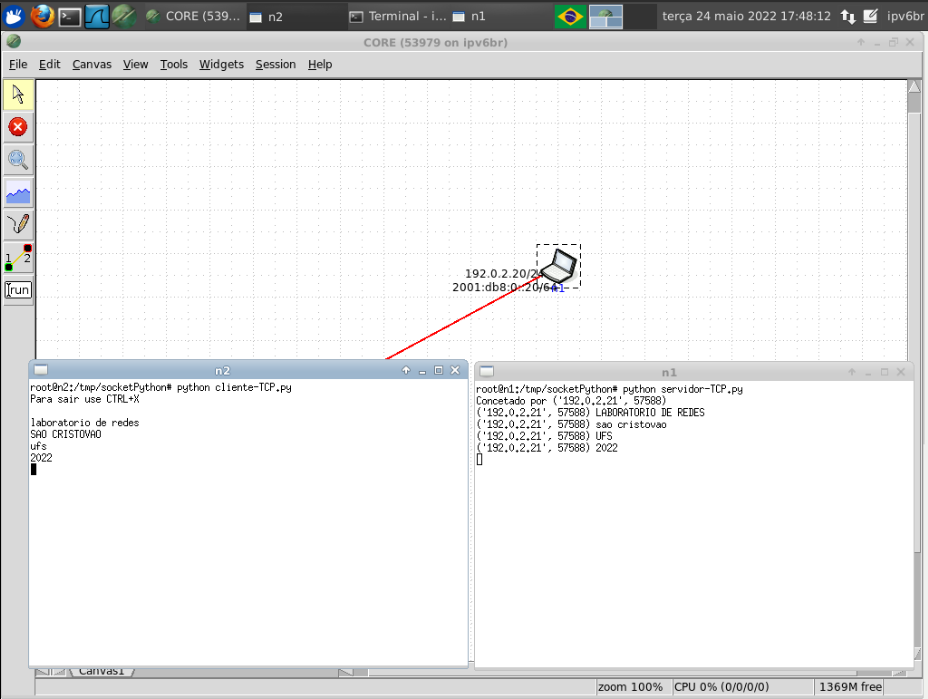

Repositório para implementar um Servidor em Python utilizando sockets().

O servidor recebe a mensagem do cliente e caso a mensagem esteja em minúsculo ele imprime na tela a mensagem em maiúsculo, caso contrario, imprime a mensagem em minúsculo.

